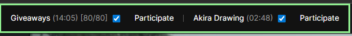
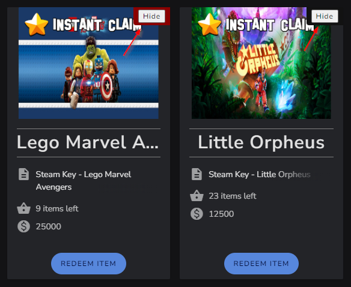

# HGF helper

## Overview
This is a small extension for the Chrome browser that allows you to play minigames on the `.tv/hitsquadgodfather` channel in semi-afk mode. It consists of two sections.

### Twitch helper

Overlay update the extension works with: **Jan 27, 2024**

   A widget mounts on the stream page, allows you to play minigames in semi-automatic mode. The main features of the widget:
1. automatically sends the `!hitsquad` command to the chat after several completed games, if the corresponding checkbox is enabled;
1. automatically recognizes the anti-cheat screen, blocking the sending of any commands. Scheduled commands will be sent automatically after the completion of the anti-cheat;
1. allows you to play the Trivia minigame. Getting into the top 5 is not guaranteed, as the algorithm relies on the answers of other participants, but you can win a few hundred points in quiet time. Also, pressing keys `1-4` allows you to quickly send the command `!answer1-4` to the chat;
1. automatically removes the delay on the stream once a minute;
1. automatically collects channel points;
1. adds a button to easily send `!hitsquad` command in manual mode;
1. automatically refreshes the stream page when there are problems with the video;
1. all features continue to work while ads are being shown;

The appearance of the widget is shown in the image below:

1. Anti-cheat screen indicator. A green frame around the widget indicates that the anti-cheat screen is not currently active. During the anti-cheat screen the frame color will change to red.
1. Checkbox that allows you to play the Trivia minigame automatically.
1. Checkbox that allows you to participate in Giveaways automatically.
**Important information**: at the moment there is no control of the allowed limit of participation (1200 entries per day), so the checkbox must be disabled manually. Automatic disabling is planned to be added in the near future.
1. Button that allows to send `!hitsquad` command in manual mode.

### StreamElements helper
The widget mounts on the store page, adds several useful features:
1. automatically sorts offers by cost when you enter the page;
1. adds a button to the offers that allows you to hide the offer (the game has already been purchased, or you already own the game);
1. adds a red background under the button if there are few keys left for a certain game;
1. automatically hides offers more expensive than 50000 clams. I did it for myself, as I am not interested in very expensive AAA games. In the future I will think about putting it in some setting (maybe);

The appearance of the widget is shown in the image below:

Important information: Some customization is required for the widget to be available (see **Installation** for details).

## Installation
1. Download the latest release (hgf-helper<area>@v1.x.y.zip) from the [releases page](https://github.com/v3il/hgf-helper/releases);
2. Unzip the archive to any directory;
3. Go to the extensions page in the Chrome browser (chrome://extensions/);
4. Turn on developer mode;
5. Click the "**Download unpacked extension**" button, specifying the path to the unpacked extension.
6. **[optional]** Open the extension pop-up window, enter your [JSONBin](https://jsonbin.io/) account credentials for the StreamElements widget to work (these credentials will not be shared)

## Update
1. Download the latest release (hgf-helper<area>@v1.x.y.zip) from the [releases page](https://github.com/v3il/hgf-helper/releases);
2. Unzip the archive to any directory;
3. Copy all the files of the new version of the extension to the directory of the old version, confirming the replacement of files;
4. On the extensions page (chrome://extensions/), click the "Update extensions" button.

## Disclaimer
**Due to frequent overlay updates, there is a chance that the extension will stop working correctly at any time. The author of the extension does not recommend leaving the stream unattended for a long time and is not responsible for any strikes received.**
